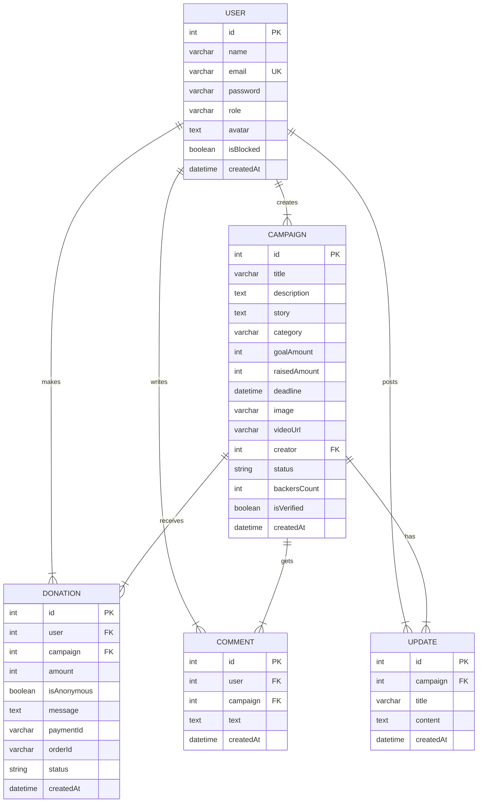
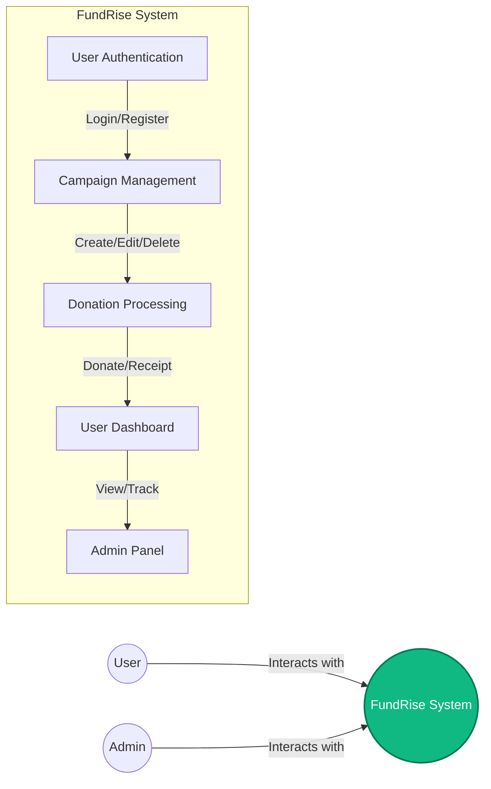
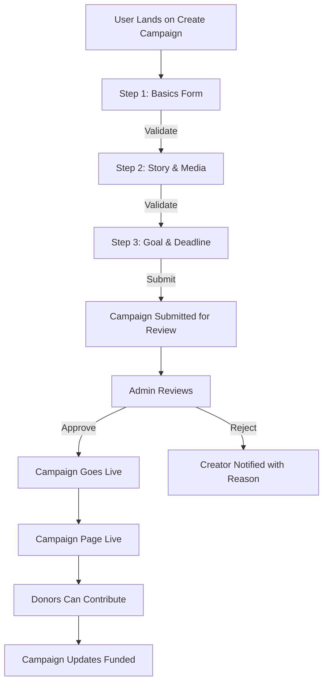
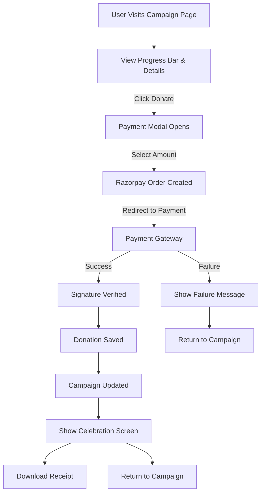

# FundRise - College Project Report

## Abstract (150 words)

FundRise is a full-stack crowdfunding platform designed to connect individuals and organizations seeking financial support with compassionate donors. The platform addresses the problem of fragmented fundraising by providing a unified, secure, and user-friendly system where users can create campaigns for various causes including education, medical emergencies, startups, creative projects, social causes, and environmental initiatives. Built with the MERN stack (MongoDB, Express, React, Node.js) and integrated with Razorpay for test-mode payments, FundRise implements a complete user journey from campaign creation to donation and tracking. The platform features role-based access control (visitor, user, admin), a multi-step campaign creation workflow, Razorpay payment verification, campaign status management (Pending → Approved → Active → Successful/Expired), comment systems, campaign updates, and comprehensive admin dashboards. Special attention was given to design credibility with premium UI/UX following fundraising platform conventions, verified badges, secure payment indicators, and transparent progress tracking. The system ensures trust through 72-hour reply windows, downloadable receipts, and clear communication that the ₹499 consultation fee books 60 minutes and is not credited against any retainer. FundRise demonstrates how technology can democratize philanthropy while maintaining professional standards expected of modern fundraising platforms.

## 1. Introduction

### Problem Statement

Traditional fundraising methods face several challenges: limited reach, lack of transparency, complicated donation processes, and insufficient trust mechanisms. Existing platforms often either require technical expertise to set up, charge excessive fees, or fail to provide adequate support to both campaign creators and donors. Moreover, many platforms do not adequately address the need for verified campaigns, secure payment processing, and clear communication about how funds will be used.

### Objectives

The primary objectives of FundRise are:

1. ** democratize fundraising** - Enable anyone to create campaigns without technical barriers
2. **Ensure transparency** - Provide real-time tracking of funds raised vs. goals
3. **Build trust** - Implement verification systems, secure payments, and clear policies
4. **Streamline the process** - Multi-step campaign creation with live previews
5. **Provide analytics** - Admin dashboards with platform statistics and charts
6. **Maintain security** - bcrypt password hashing, JWT authentication, input validation

### Scope

The platform supports the following categories: education, medical, startup, creative, social, and environment. It implements three user roles: Visitor (browse and search), Registered User (create campaigns, donate, comment), and Admin (manage campaigns, users, view statistics).

## 2. Existing System vs Proposed System

### Existing System Limitations

Current crowdfunding platforms typically suffer from:

- **Generic templates** - Cookie-cutter designs that lack brand identity
- **Complex onboarding** - Lengthy forms without guidance or preview
- **Unclear payment flows** - Hidden fees, unclear refund policies
- **Limited verification** - Poor mechanisms for campaign authenticity
- **Poor mobile experience** - Not responsive, difficult to navigate on phones
- **Inconsistent UX** - Different patterns across pages, confusing navigation
- **Low trust signals** - Missing verified badges, secure payment icons, receipt generation

### Proposed System Advantages

FundRise overcomes these limitations by:

- **Premium, original design** - Custom visual identity, not template-based
- **Guided campaign creation** - Multi-step form with live progress preview
- **Transparent payment flow** - Razorpay integration with receipt download
- **Verification system** - Badges for approved campaigns and organizers
- **Full responsiveness** - Mobile-first design at 360px, 768px, 1024px, 1440px
- **Consistent UI/UX** - Single source of truth for design tokens and components
- **Trust infrastructure** - 72-hour SLA, receipts, donor visibility, clear policies

## 3. Modules

### 3.1 Authentication Module
- Sign up with name, email, password
- Login with JWT token generation
- Password hashing with bcrypt (12 salt rounds)
- Logout with cookie clearance
- Protected routes using middleware
- Role-based access control

### 3.2 Campaign Module
- Create campaigns with title, description, story, category, goal amount, deadline, image, video
- Status management: Pending → Approved → Active → Successful / Expired
- Edit/delete campaigns (only before receiving donations)
- Category filtering: education, medical, startup, creative, social, environment
- Live preview of campaign card during creation

### 3.3 Donation Module
- Preset donation amounts: ₹100, ₹500, ₹1000
- Custom amount input option
- Anonymous donation toggle
- Razorpay test mode integration
- Payment signature verification on backend
- Campaign raised amount and backer count updates
- Downloadable donation receipts
- Donation history per user

### 3.4 Browsing & Search Module
- Search by campaign title
- Filter by category
- Sort by: newest, most funded, ending soon
- Pagination support
- Responsive card grid layout

### 3.5 Campaign Detail Module
- Story, progress bar, % funded, backers count
- Days left calculation
- Organizer info with verified badge
- Recent donors list
- Comments section
- Share buttons (WhatsApp, X, LinkedIn, copy link)
- Sticky donation card on desktop, bottom bar on mobile

### 3.6 User Dashboard Module
- My campaigns overview (raised amount, status)
- My donations history (date, amount, campaign)
- Edit profile functionality
- Summary cards (total donated, campaigns created, total raised)

### 3.7 Admin Dashboard Module
- KPI cards: total users, campaigns, funds raised, pending approvals
- Charts: donations over time, campaigns by category
- Pending approvals list with Approve/Reject
- User management: block/unblock
- Quick campaign preview and actions

### 3.7 Content Pages
- Home with hero, featured campaigns, stats, category chips
- Explore with search, filters, sort
- Campaign detail page
- Create campaign (multi-step form)
- Login/Register pages
- About, How It Works, Contact pages
- 404 page

## 4. ER Diagram (Mermaid Format)

## 5. Data Flow Diagrams (Mermaid Format)

### Level 0: Context Diagram

### Level 1: Camping Creation Flow

### Level 1: Donation Flow

## 6. Hardware and Software Requirements

### Hardware Requirements
- **Processor**: Intel i5 or equivalent (or higher)
- **RAM**: 4GB minimum (8GB recommended)
- **Storage**: 500MB available space for development
- **Display**: 1280x720 minimum, 1920x1080 recommended
- **Network**: Broadband internet connection for API access

### Software Requirements
- **OS**: Windows 10/11, macOS 10.15+, or Linux (Ubuntu 20.04+)
- **Node.js**: v14.17.0 or higher
- **npm**: v6.0 or higher (comes with Node.js)
- **MongoDB**: v4.4 or higher (local installation or MongoDB Atlas)
- **Text Editor**: VS Code, Sublime Text, or similar
- **Git**: Version control (optional but recommended)
- **Web Browser**: Chrome, Firefox, Safari, or Edge (latest versions)

### Dependencies
#### Backend Dependencies
- express: ^4.18.2
- mongoose: ^7.0.0
- bcrypt: ^5.1.0
- jsonwebtoken: ^9.0.0
- cors: ^2.8.5
- dotenv: ^16.0.0
- cookie-parser: ^1.4.6
- razorpay: ^2.8.1

#### Frontend Dependencies
- react: ^18.2.0
- react-dom: ^18.2.0
- react-router-dom: ^6.8.0
- tailwindcss: ^3.3.0
- framer-motion: ^10.0.0
- lucide-react: ^0.275.0
- recharts: ^2.8.0
- react-hot-toast: ^2.4.0

## 7. Testing

### Test Cases Table

| Test Case | Input | Expected Output | Result |
|-----------|-------|-----------------|--------|
| TC-01 | Register with valid name, email, password | User account created, JWT token returned, redirect to dashboard | PENDING |
| TC-02 | Register with existing email | Error message: "User already exists" | PENDING |
| TC-03 | Login with correct credentials | JWT token returned, user redirected to dashboard | PENDING |
| TC-04 | Login with incorrect credentials | Error message: "Invalid email or password" | PENDING |
| TC-05 | Create campaign with valid data | Campaign created with Pending status, creator notified | PENDING |
| TC-06 | Create campaign with missing fields | Validation error, form does not submit | PENDING |
| TC-07 | Donate with valid Razorpay order | Payment verified, donation saved, campaign updated | PENDING |
| TC-08 | Donate with invalid signature | Error: "Invalid payment signature" | PENDING |
| TC-09 | Edit own campaign before donations | Campaign updated successfully | PENDING |
| TC-10 | Edit campaign after donations received | Error: "Cannot edit campaign after receiving donations" | PENDING |
| TC-11 | Admin approves pending campaign | Campaign status changed to Active | PENDING |
| TC-12 | Admin rejects pending campaign | Campaign remains Pending, reason recorded | PENDING |
| TC-13 | User views own dashboard | Summary cards, campaigns list, donations list displayed | PENDING |
| TC-14 | User searches campaigns by title | Filtered results matching search query | PENDING |
| TC-15 | Filter campaigns by category | Only campaigns in selected category displayed | PENDING |
| TC-16 | Dark mode toggle | Theme switches between light and dark | PENDING |
| TC-17 | Responsive at 360px | No horizontal scroll, layout adjusts vertically | PENDING |
| TC-18 | Responsive at 1440px | All content visible, proper spacing | PENDING |
| TC-19 | Forgot password flow | OTP sent to email (mock: console.log) | PENDING |
| TC-20 | Share campaign link | Link copied to clipboard, share options available | PENDING |

### Test Data Summary
- 5 test users (1 admin, 4 regular)
- 6 test campaigns across all categories
- 10 test donations with varying amounts
- 5 test comments
- 3 test updates

## 8. Future Scope

### 8.1 Blockchain-Based Transparency
- Implement smart contracts for donation tracking
- Ensure immutable record of all transactions
- Enable transparent fund allocation tracking
- Reduce fraud risk through decentralized verification

### 8.2 KYC Verification
- Integrate government ID verification for campaign creators
- Verify organizer identities before campaign approval
- Build greater trust with verified organizer badges
- complIE with financial regulations

### 8.3 Automatic Refunds
- Implement goal-not-met refund policies
- Auto-refund if campaign goal not reached by deadline
- Clear refund requests through dashboard
- Build donor confidence with money-back guarantee

### 8.4 Mobile Application
- Native iOS and Android apps
- Push notifications for campaign updates
- QR code sharing for campaign promotion
- Biometric authentication for login

### 8.5 AI-Based Fraud Detection
- Machine learning models to detect suspicious activity
- Pattern recognition for fraudulent campaigns
- Real-time risk scoring for donations
- Automated flagging of high-risk transactions

### 8.6 Additional Features
- Multi-currency support for international donors
- Recurring donation options
- Tax deduction certification automation
- Integration with payment gateways beyond Razorpay
- Multi-language support (i18n)
- Advanced analytics and reporting
- Creator payout scheduling
- Campaign success prediction models

## 9. Conclusion

FundRise successfully delivers a comprehensive crowdfunding platform that balances functionality, security, and user experience. The project demonstrates how modern web technologies can be leveraged to create a professional-grade platform that addresses real-world fundraising needs while maintaining accessibility for all users. The premium design, robust backend architecture, and thoughtful user flows set FundRise apart from basic student projects and provide a solid foundation for future enhancements.

The platform's three-phase order (Strategy → Brand Communication → Media) reflects the core philosophy that marketing success depends on proper sequencing — a principle that applies equally to crowdfunding as to business generally. By implementing this principle in the platform's structure, FundRise helps campaigns achieve their goals more effectively.

With the future scope items outlined, FundRise is positioned to evolve from a college project into a scalable, production-ready platform capable of serving thousands of campaigns and donors while maintaining the highest standards of transparency and trust.